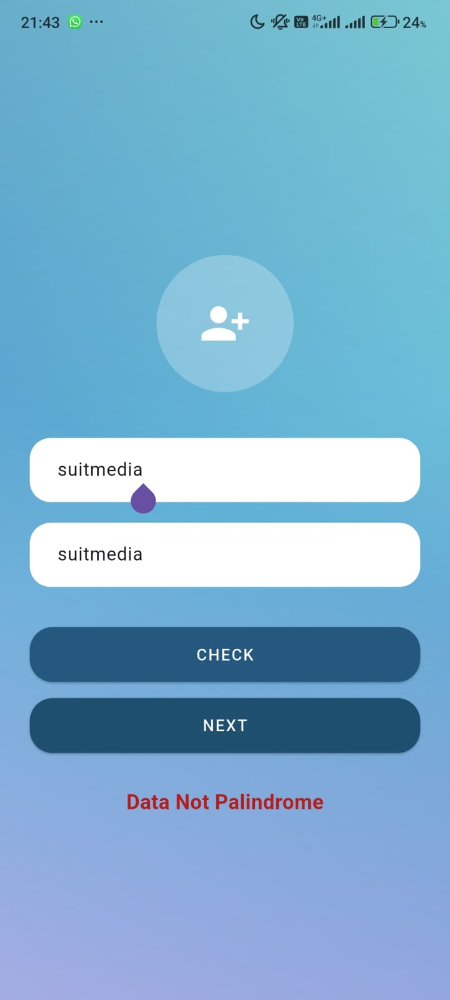
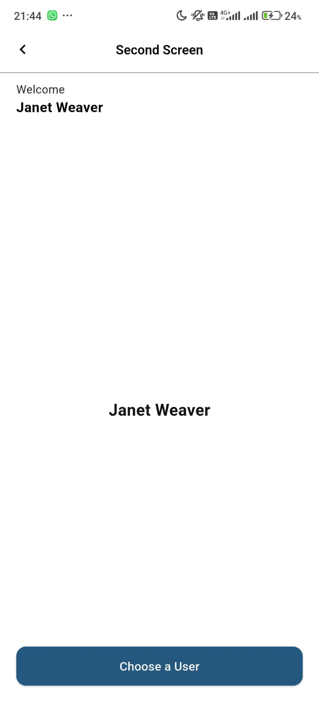
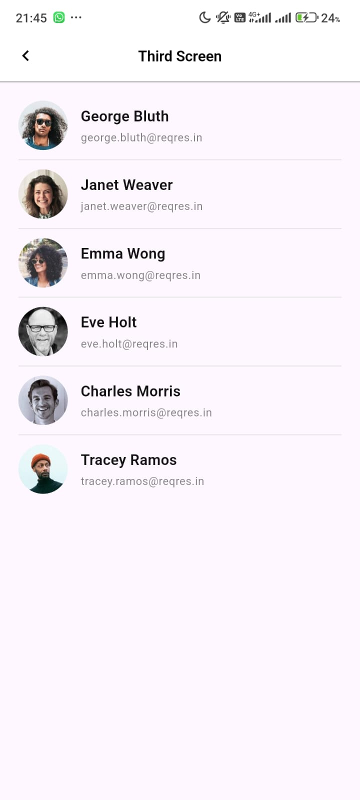

# <b>DOC</b> | palindrome_app 


<table>
  <tbody>
    <tr>
      <td></td>
      <td></td>
      <td></td>
      <td></td>
    </tr>
  </tbody>
</table>


## Getting Started

Repository ini berisi source code untuk aplikasi Palindrome App yang dibangun menggunakan Flutter, serta memanfaatkan:

- Bloc State Management
- Dio Client
- REST API (ReqRes API)

Struktur Folder : 
```
lib/
├── bloc/
│   ├── users/
│   │   └── user.bloc.dart
|   |   └── ....
│   ├── logic.palindrome.cubit.dart
│   └── manage.selected.user.cubit.dart
│
├── core/
│   └── dio.client.dart
│
├── repository/
│   └── user.repository.dart
│
├── model/
│   └── user.model.dart
│
├── screen/
│   ├── screenOneInput.dart
│   ├── screenTwoDetail.dart
│   └── screenThreeChoose.dart
│
└── main.dart

```
Penjelasan Singkat Setiap Folder : 
- bloc/ → state management
- core/ → konfigurasi client, helper, utilitas
- model/ → entity / data model
- repository/ → sumber data dari API
- screen/ → UI & Page Flutter

Langkah yang perlu diperhatikan untuk mengambil repository ini terbagi dengan beberapa langkah sebagai berikut 🔽 : 

1. Pastikan anda mempersiapkan API KEY untuk menselaraskan apa yang ada di aplikasi ini. Anda bisa ambil dari REST API <a>https:reqres.in/api</a> klik berikut <a href="https://app.reqres.in/documentation">⏭️</a> untuk dokumentasi penggunaan API.

Setelah mempersiapkan API KEY anda dapat melakukan langkah selanjutnya step setup project : 


## 1 Clone Repository
Pertama anda clone dulu repository ini dengan command sebagai berikut :
```
git clone https://github.com/Lisgiyanto1/palindrome_app.git

```
kemudian setelah clone repository pastikan anda masuk ke folder project terlebih dahulu : 
```
cd palindrom_app
```
## 2 Create Environtment
Buat file .env di local project anda pastikan berisi seperti ini : 
```
API_KEY=apikeyandapadareqres
BASE_URL=https://reqres.in/api
```
## 3 Install Dependencies
Selanjutnya install dependencies yang digunakan project : 
```
flutter pub get
```
## 4 Run App
Kemudian yang terakhir : 
```
flutter run
```

<b>NB</b> : Anda bisa menggunakan Emulator atau USB connector untuk eksternal debug.

__TERIMAKASIH 😄___
